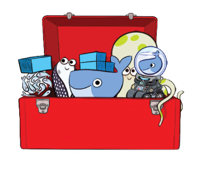

# Eine Einführung in Docker

---

## Warnhinweis

<small>
Bei einigen Personen kann es zu Langeweile-Anfällen kommen, wenn sie bestimmten technischen Details oder Konsolen und Befehlszeilenfolgen ausgesetzt sind. Befragen Sie Ihren Kollegen, falls Sie hauptberuflich in Krawatte gekleidet sind, bevor Sie diesem Vortrag folgen. Brechen Sie den Vortrag sofort ab und suchen Sie einen Espressohändler oder ein Businesskasper-Meeting auf, sollte eines der folgenden Symptome beim Zuhören auftreten: Sehstörungen, Augen- und Muskelzucken, Bewusstseinsstörungen, Orientierungsverlust oder unfreiwillige Bewegungen. 
</small>

---

## Warnhinweis

* Docker ist schwierig zu erfassen ohne einen praktischen Einblick
* deswegen heute:
	* keine hübschen Diagramme
	* keine lustigen Katzenbildchen
	* Tipperei auf der Konsole
	* evtl. Fragezeichen

---

## Warnhinweis

* Ziel des Vortrags:
	* Überblick über die Intention von Docker
	* Einblick in die Technik von Docker
	* und viel Tech-Demo
* Ziel ist nicht:
	* selbstständige Anwendung (dafür braucht es insbes. Praxis)
	* Diskussion über Sinn und Unsinn von Docker

---

## Inhalt

* Was ist Docker?
* Motivation
* Wie funktioniert das?
  * Container & Images
  * Docker-Engine
  * Docker-Hub & Registry
  * Images selbst erstellen
  * Docker-Compose
* Fazit
	* Warum Docker?
	* Sonstige Infos

---

## Was ist Docker?

<q cite="https://www.docker.com/enterprise">
 &ldquo;Docker provides an integrated technology suite that enables development and IT operations teams to build, ship, and run distributed applications anywhere.&rdquo;</q>
<p style="text-align:right"><a href="https://www.docker.com/enterprise">docker.com</a></p>

* Docker bietet eine Sammlung von Software-Tools <!-- .element: class="fragment" -->
* fokussiert auf Entwicklung, Installation und Betrieb verteilter Anwendungen <!-- .element: class="fragment" -->
* hat 2 Zielgruppen: Dev + Ops = DevOps <!-- .element: class="fragment" -->
* wird von Docker Inc. entwickelt (Firma bietet die Docker-Infrastruktur gegen Cash) <!-- .element: class="fragment" -->

---

## Motivation
<!-- .slide: data-transition="none" -->


--

## Motivation
<!-- .slide: data-transition="none" -->


--

## Motivation
<!-- .slide: data-transition="none" -->


--

## Motivation
<!-- .slide: data-transition="none" -->


--

## Motivation
<!-- .slide: data-transition="none" -->


--

## Motivation
<!-- .slide: data-transition="none" -->


--

## Motivation
<!-- .slide: data-transition="none" -->


--

## Motivation
<!-- .slide: data-transition="none" -->


--

## Motivation
<!-- .slide: data-transition="none" -->


--

## Motivation
<!-- .slide: data-transition="none" -->


--

## Motivation


--

## 
<!-- .slide: data-transition="none" -->
<!-- .slide: data-background="./img/dh11.svg" data-background-size="75%" -->

--

## Motivation
<!-- .slide: data-background="./img/dh12.svg" data-background-size="75%" -->
1. Einsparung von Hardware-Kosten
2. einfachere Benutzung (im Vergleich zu VMs bzw. anderen DevOps-Techniken wie Ansible, Vagrant, etc.)  <!-- .element: class="fragment" -->
3. engere Verzahnung von Entwicklung und Betrieb  <!-- .element: class="fragment" -->

---

## Wie funktioniert das?

mit Images, Containern und der Docker-Engine <!-- .element: class="fragment" -->
  

---

### Container

* Container sind eine alte Technologie: FreeBSD Jails, Solaris Zones, Linux LXC, OpenVZ, Google lmctfy
* in Java bspw.: Tomcat

--

### Container

* separieren Prozesse voneinander
* mittels Kernelmechanismen wie IPC-/Mount-Namespaces und Control-Groups
* Prozesse bekommen nur Ausschnitt des Gesamtsystems zur Verfügung gestellt
* kapseln also eine laufende Anwendung

--

### Container vs. VMs

* Virtualisierung mit VMs setzt auf Emulierung von Geräten (CPU, GPU, RAM, HDD, etc.)
* mittels VMs sind unterschiedliche Betriebssysteme möglich, mittels Containerisierung nicht
* Containerisierung abstrahiert den Betriebssystem-Kernel, startet kein eigenes Betriebssystems
* der durch VMs eingebrachte Overhead fällt weg
* Container können dennoch gestartet, gestoppt, pausiert werden

--

### Dockers Beitrag zu Containern

* Schnittstelle zur einfachen Benutzung der Kernelmechanismen
* Format für portable Container-Images definiert
* Docker-Engine für den Betrieb von Containern

---

### Images

* ist die Basis, auf der ein Container gestartet wird
* beinhaltet alle ausführbaren Programme
* ein Container ist die Instanz eines Images!

--

### Images = \sum_{x=0}^{i} Layer_i

<div class='span6'>
 <ul>
  <li>bestehen aus einem Stack von Layern</li>
  <li>Images und deren Layer sind read-only</li>
  <li>jeder Container bekommt einen Read-Write-Layer als oberste Ebene</li>
  <li>ist der Container weg, sind die Daten weg</li>
</ul> 
</div>
<div class='span6'>
 
</div>

--

### Images = \sum_{x=0}^{i} Layer_i

<div class='span6'>
 <ul>
  <li>jeder Layer ist ein 'Diff' zu dem Layer auf den dieser aufbaut</li>
  <li>werden mittels Union-File-System zusammengefasst</li>
</ul> 
</div>
<div class='span6'>

</div>

---

### Docker-Engine
* besteht min. aus zwei Teilen (die sogenannte Engine):
	* dockerd: daemon zum Betrieb von Containern
	* docker: client-Interface zur Steuerung von dockerd

---

### Docker-Hub & Docker-Registry

* ist das Image-Repository von Docker
* per default genutzt, um neue Images zu laden
* für in-House-Verwaltung von Images: Docker-Registry
* Docker-Hub = Docker-Registry + Web-Frontend


---

### 5h3ll-p0rn

--

#### Basics

``` bash
# Image starten mit Download aus Hub, falls notwendig
docker run hello-world
# ein Linux Image starten und einen Befehl im Container ausführen
docker run alpine echo hello-world
# Docker-Hub durchsuchen
docker search jenkins
# aktive Container anzeigen
docker ps
# alle Container anzeigen
docker ps -a
# Container entfernen
docker rm <container_name>
# alle gestoppten Container entfernen
docker rm $(docker ps -aqf status=exited)
## Ids aller beendeten Container
docker ps -aqf status=exited
```

--

#### Management von Images

``` bash
# lokal gespeicherte Images anzeigen
docker images
# Image entfernen
docker rmi MyImage
# ein neues Image aus einem Container erstellen:
## neuen Container erstellen
docker run --name MyContainer alpine touch hello-esag
## committen mit Änderung des run-Befehls
docker commit --change='CMD ["echo hello-world"]' MyContainer MyImage
## neuen Container starten
docker run MeinImage
```

--

### häufig benutzte docker-run Argumente

``` bash
# dem Container einen Namen geben
--name <name>
# entfernt den Container, sobald er beendet ist
--rm
# container als Daemon starten (nicht kombinierbar mir --rm)
-d
# mappt den **Host-Port 8181** auf den **Container-Port 8080**
-p 8181:8080
# Ordner von außen in den Container einbinden
-v /voller/Quell/Pfad:/voller/Container/Pfad
```

---

## Images selbst erstellen
zwei Möglichkeiten um Images zu erstellen:
1. Änderungen am Container commiten -> neues Image wird erstellt (macht kaum noch jemand)
2. Dockerfile zur Beschreibung eines Image

Image = docker-build(Dockerfile)

---

### 5h3ll-p0rn II

--

#### ein Microservice tobidocker
- startet einen microservice
- auf Port 8080 ist ein Button abrufbar
- auf klick wird ein Zähler hochgezählt
- aktuelle Zählerstand ist in Datei gespeichert
``` bash
./TobiDocker server config.yml
```

--

#### Beispiel Docker-Buildfile

```
FROM java:8-jre
MAINTAINER Tobias Blaschke <blaschke@eudemonia-solutions.de>

COPY ./TobiDocker /docker

RUN mkdir /data && chmod +x /docker/bin/TobiDocker
EXPOSE 8080
CMD ["/docker/bin/TobiDocker", "server", "/docker/bin/config.yml"]
```

--

#### das Image bauen
- der Ordner *tobidocker* und das Buildfile *Dockerfile* müssen in demselben Ordner liegen
- `docker build -t esag/dockerdemo:v1 .`
	- `-t` gibt dem neuen Image einen neuen Namen
	- `esag/dockerdemo` ist der neue Name
	- `:v1` ist die Versionsnummer
- `docker images` listet unser neues Image

--

#### das Image starten

* neu erstelltes Image starten (Port mappen nicht vergessen)
``` bash
docker run --rm -p 8181:8080 esag/dockerdemo:v1`
```
	* evtl. Volume einbinden 
	``` bash 
	-v /d/datenMuell/dockerdemo/data:/data 
	```
	* Quellverzeichnis "überlagert" Zielverzeichnis (kein löschen der darin vorhandenen Daten)
	* funktioniert mit Dateien, Ordnern oder Containern
	* Zugriff unter Windows über die VM-IP, nicht localhost! Meistens die IP: `192.168.99.100:8181`
	* unter Windows `/c/Users/...` statt `C:\Users\...`

---

### Best-Practice

* immer offizielle Hub-Images bevorzugen. Warum?
	* Image ist so vorbereitet, wie es der Hersteller für den Betrieb vorgesehen hat
	* selbst ändert man nur die Konfiguration, benötigt also keine Erstellung eines Images

--

### Best-Practice

* wenn ein eigenes Image, dann auch mit Dockerfile
	* [best practice für Dockerfile](https://docs.docker.com/engine/userguide/eng-image/dockerfile_best-practices/)
	* Dockerfile selbstverständlich in einem Repository pflegen
	* keine Daten in das Image, nur Binaries (auch nicht Testdaten)
	* möglichst wenige Änderungen vornehmen

---

### Docker-Compose

* Werkzeug für multi-Container-Anwendungen
* Konfiguration und Verwaltung untereinander abhängiger Container


---

### 5h3ll-p0rn III

--

#### Beispiel Compose-File

```
version: '2'
services:
        dockerdemo:
                #build: ./docker-build
                image: esag/dockerdemo:v1
                ports:
                        - 8080
                volumes:
                        - ./data:/data
```

--

#### Compose nutzen und skalieren

```bash 
# Alle definierten Services starten (in unserem Fall nur einer)
docker-compose up -d
# Infos zu den gestarteten Containern
docker-compose ls
# Logs der Container ausgeben
docker-compose logs
# weitere Instanzen eines bestimmten definierten Services starten
docker-compose scale dockerdemo=4
```
  * ein zusätzlicher Load-Balancer (bspw. HAProxy) verteilt dann Anfragen
  * dank des Volume nutzen alle Container dieselben Daten

---

## Warum Docker?

1. Einsparung von Hardware-Kosten
2. einfachere Benutzung (im Vergleich zu VMs bzw. anderen DevOps-Techniken wie Ansible, Vagrant, etc.) 
3. engere Verzahnung von Entwicklung und Betrieb

--

### Einsparung von Hardware-Kosten

* Wiederverwendung von Images spart Speicherplatz
* Einsparung von Ressourcen wie RAM und CPU, wodurch auf einer Maschine ein vielfaches an Containern gegenüber VMs möglich ist
* Betrieb sehr kleiner Buildartefakte erst sinnvoll möglich (bspw. bei Microservices)
* da Container schneller bereit stehen, skalieren diese besser
* klare Definition der Abhängigkeiten bewirkt aufräumen der Infrastruktur

--

### Einfachere Benutzung: Ops

* Anwendungen in standardisierten Container
* Container lassen sich alle identisch warten, automatisieren, installieren
* sind verwendbar wie Apps (für Server)

--

### Einfachere Benutzung

* **Dev**: Deployment-Dokumentation als Docker-Buildfile und Compose-File als Bestandteil des Repositories (Infrastructure as Code)
* **QM**: schnelles anstarten beliebig ausgelieferter Versionen auf dem eigenen PC (oder auch in einer Cloud-Umgebung)

--

### Engere Verzahnung von Entwicklung und Betrieb

* durch Portabilität der Container: Image-Bereitstellung durch Ops für Dev möglich mit Sicherstellung von bspw. Monitoring, Logging oder Firewall-Richtlinien
* produktionsnahe bis -äquivalente Umgebung auf der eigenen Entwicklungsmaschine
* seltenere "runs on my system" - Phänomene
* Auslieferung von Containern als Build-Artefakt

---

### Nachteile

* [boycott Docker](http://www.boycottdocker.org/)
* über verschiedene Architekturen (X86, ARM) hinweg nicht portabel 
* kostenfreie Web-Interfaces nur über Dritt-Anbieter (panamax, shipyard, dockerui, ...)
* sehr junges Projekt, noch immer in in kontinuierlicher Weiterentwicklung der APIs

---

## weitere Docker-Tools
Machine zur Einrichtung von Docker auf einer VM oder auf Remote-Hosts.


---

## weitere Docker-Tools
Swarm zur automatischen Verteilung von Containern auf die verschiedenen Docker-Hosts.


---

## Docker unter Windows und MacOs
- [Docker-Toolbox](https://www.docker.com/products/docker-toolbox) beinhaltet:
	- Engine
	- Compose
	- Machine
	- Kitematic: GUI für Docker



---

## Über den Tellerrand geschaut

[Container Hacks and Fun Images (youtube)](https://www.youtube.com/watch?v=1qlLUf7KtAw)
* skype dockerized
* Browser dockerized
* Multiroom-Audio mittels desselben Docker-Images verteilt auf einem RasPi-Cluster

---

## noch mehr Links

- [Cheat-Sheet](https://github.com/wsargent/docker-cheat-sheet)
- [Dockerfile reference](https://docs.docker.com/engine/reference/builder/)
- [Compose file reference](https://docs.docker.com/compose/compose-file/)
- [Docker Toolbox für Windows und Mac](https://www.docker.com/products/docker-toolbox)
- [Dockerfiles aus 'Fun Images' (github)](https://github.com/jfrazelle/dockerfiles)
